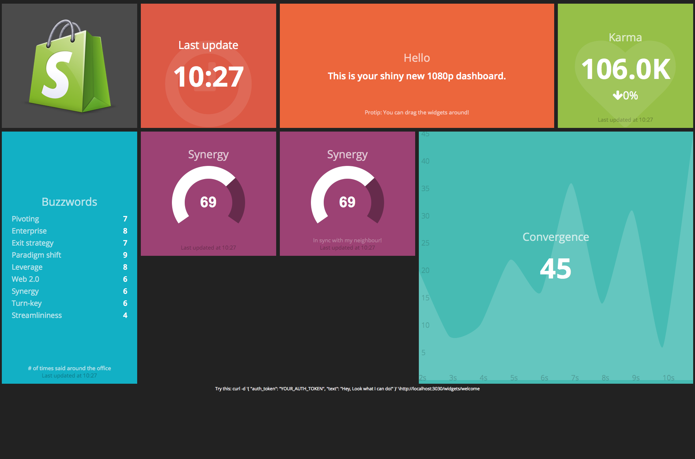

# Dashing::Screenshots

So you have a bunch of [Dashing](http://dashing.io/) dashboards and want a screenshot of all of them? You've come to right place.

## Setup

* Add this gem to your gem file.
* Make a Rakefile if you don't have more

```ruby
namespace :dashing do
  desc "takes screenshots"
  task :screenshots do
    require 'dashing-screenshots'
    Dashing::Screenshot.new("screenshots", log: true).capture!
  end
end
```

## Run it

Run `bundle exec rake dashing:screenshots`

It will pop up Firefox and take some pictures. It will save them in the directory you specified. The given code would save them within your project. You can also give an absolute path to put them anywhere on the system.


